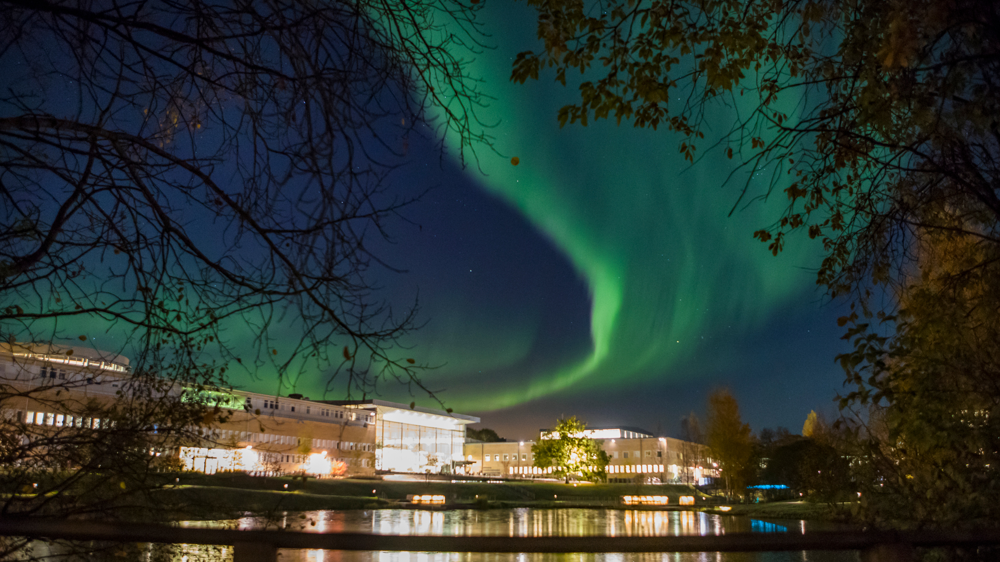
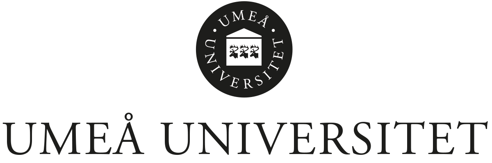

Winter School on ELSAI and AS

- [Winter School on ELSAI and AS](index.html)
- [Register now](form.html)
- [Schedule](schedule.html)

# Winter School on Ethical, Legal, and Societal (ELS) aspects of AI and AS at Umeå University

**07–09 April, 2027**

We are pleased to announce the Winter School on Ethical, Legal, and Societal (ELS) aspects of Artificial Intelligence
(AI) and Autonomous Systems (AS) 2027 at Umeå University, Sweden.
At this Winter School, we will offer exciting lectures in the field of Ethical, Legal, and Societal aspects of AI and
Autonomous Systems as well as helpful hands-on multi-disciplinary and complementary training.
The whole event will be accompanied by a poster session and a social program, which will provide opportunities for
networking and professional exchange.
We look forward to welcoming you to Umeå in April 2027!

_Monowar Bhuyan, Julian Mendez, and Virginia Dignum_

[Responsible AI Group](https://www.umu.se/en/research/groups/responsible-artificial-intelligence/)

 _©_ _Mattias Pettersson_

# Status Updates on the Winter School

**1 November 2026:** The preliminary program of the Winter School is published and can be viewed
under [Schedule](schedule.html).

**1 December 2026: Registration opens**
(Read the instructions carefully before you register)

- **Non-WASP participants**: Register for the Winter School via [Link](form.html).
- **WASP-HS students**: Participants register via [Link](form.html).
- **WASP students**: Register using the personal registration links sent to them in the
  invitation for the spring semester courses.

Deadline for registration: **28 February 2027**

<!--     -->

  
  
  
  

# Registration fee

Anyone else can register via the registration link provided below and will receive an invoice to pay a registration fee.
The registration fee will be utilized to cover the logistics and offer meals during the school.

- Students pay 1500 SEK.
- Faculty members pay 2500 SEK.
- Other participants pay 4000 SEK.

# Arrival at the venue

The Winter School on ELSAI and AS will take place at Umeå University: 07–09 April 2027 in Hörsal HUM.D.230 - Hohaj.
This is located close to the Universum Bus stop. Several parking spots of the university are located close to the
Universum.
By public transport, the best way to reach the university from the city center is to take bus lines 2, 5, 8 or 9 to the
bus stop _Universum_, or bus 1 to the bus stop _Samhällsvetarhuset_.
In both cases, the travel time is about 10 minutes. If you prefer to walk, then it takes around 35 minutes.

The Poster Session will be in MIT Ljusgården / MIT-Place, which is in the MIT Building, close to the bus stop
_Universum_.

### 07–09 April

Hörsal HUM.D.230 - Hohaj

[Map by MazeMap](https://use.mazemap.com/?campusid=289&sharepoitype=identifier&sharepoi=Humanisthuset-2-0056)

### 08 April (Poster Session)

[Map by MazeMap](https://use.mazemap.com/?campusid=289&sharepoitype=identifier&sharepoi=MIT-huset-A2.11.15)

# Accommodation

You may find hotels for recommendation and booking links below.
Please visit the links to finalize your bookings directly with the hotels.
Note that Umeå University has no booking agreements with any of the hotels.

- [Comfort Hotel Umeå City](https://www.choicehotels.com/sweden/umea/comfort-inn-hotels/se135)
- [Clarion Hotel Umeå](https://www.choicehotels.com/sweden/umea/clarion-hotels/se142)
- [Stora Hotellet](https://storahotelletumea.se/)
- [U&Me Hotel](https://umehotel.se/)
- [Norrland YMCA Hostel Umeå](https://www.ny-hostel.se/)

# Submission of poster

If you are interested in submitting a poster, it must be relevant to the School theme. To confirm its relevance, please
submit an abstract (maximum **1000 characters**) before **28 February 2027**, using
the [online submission form](form.html).
Information on how to upload your poster will follow in due time.
This will help us estimate how many posters will be presented at the poster session.

**Important:** Please make sure that you bring a printed poster in **size A1** for the event itself.

You have creative freedom in designing the layout, but please ensure the use of clear and easily readable fonts and font
sizes, as well as legible color contrasts.

# Contact information

If you have any questions, please feel free to contact Julian Mendez
([julian.mendez@cs.umu.se](mailto:julian.mendez@cs.umu.se)) or Monowar Bhuyan
([monowar@cs.umu.se](mailto:monowar@cs.umu.se)).

